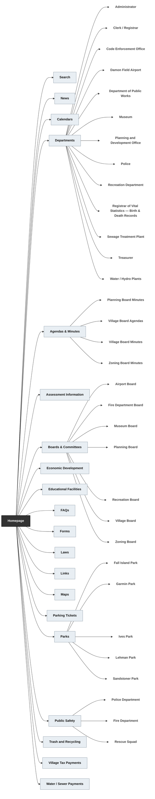

# Website Sitemap

Source: https://ericyork.github.io/eg_sitemap/

```mermaid
flowchart LR
    SITE["Homepage"]

    SITE --> SEARCH["Search"]
    SITE --> NEWS["News"]
    SITE --> CAL["Calendars"]
    SITE --> DEPT["Departments"]
    SITE --> AGENDAS["Agendas & Minutes"]
    SITE --> ASSESS["Assessment Information"]
    SITE --> BOARDS["Boards & Committees"]
    SITE --> ECON["Economic Development"]
    SITE --> EDU["Educational Facilities"]
    SITE --> FAQ["FAQs"]
    SITE --> FORMS["Forms"]
    SITE --> LAWS["Laws"]
    SITE --> LINKS["Links"]
    SITE --> MAPS["Maps"]
    SITE --> PARKING["Parking Tickets"]
    SITE --> PARKS["Parks"]
    SITE --> SAFETY["Public Safety"]
    SITE --> TRASH["Trash and Recycling"]
    SITE --> TAX["Village Tax Payments"]
    SITE --> SEWER["Water / Sewer Payments"]

    DEPT --> ADMIN["Administrator"]
    DEPT --> CLERK["Clerk / Registrar"]
    DEPT --> CODE["Code Enforcement Office"]
    DEPT --> AIRPORT["Damon Field Airport"]
    DEPT --> DPW["Department of Public Works"]
    DEPT --> MUSEUM["Museum"]
    DEPT --> PLAN["Planning and Development Office"]
    DEPT --> POLDEPT["Police"]
    DEPT --> REC["Recreation Department"]
    DEPT --> VITAL["Registrar of Vital Statistics — Birth & Death Records"]
    DEPT --> SEWAGE["Sewage Treatment Plant"]
    DEPT --> TREAS["Treasurer"]
    DEPT --> WATER["Water / Hydro Plants"]
    AGENDAS --> PLANMINS["Planning Board Minutes"]
    AGENDAS --> VILLAGEND["Village Board Agendas"]
    AGENDAS --> VILLMINS["Village Board Minutes"]
    AGENDAS --> ZONEMINS["Zoning Board Minutes"]

    BOARDS --> AIRPORTB["Airport Board"]
    BOARDS --> FIREB["Fire Department Board"]
    BOARDS --> MUSEUMB["Museum Board"]
    BOARDS --> PLANNINGB["Planning Board"]
    BOARDS --> RECB["Recreation Board"]
    BOARDS --> VILLAGEB["Village Board"]
    BOARDS --> ZONINGB["Zoning Board"]

    PARKS --> FALLI["Fall Island Park"]
    PARKS --> GARMIN["Garmin Park"]
    PARKS --> IVES["Ives Park"]
    PARKS --> LEHMAN["Lehman Park"]
    PARKS --> SANDSTONER["Sandstoner Park"]

    SAFETY --> POLICE["Police Department"]
    SAFETY --> FIRE["Fire Department"]
    SAFETY --> RESCUE["Rescue Squad"]

    classDef root fill:#333,color:#fff,stroke:#111,stroke-width:2px,font-weight:bold;
    classDef section fill:#e8eef3,color:#111,stroke:#788896,font-weight:bold;
    classDef leaf fill:transparent,color:#444,stroke:transparent;

    class SITE root;

    class SEARCH,NEWS,CAL,DEPT,AGENDAS,ASSESS,BOARDS,ECON,EDU,FAQ,FORMS,LAWS,LINKS,MAPS,PARKING,PARKS,SAFETY,TRASH,TAX,SEWER section;

    class ADMIN,CLERK,CODE,AIRPORT,DPW,MUSEUM,PLAN,POLDEPT,REC,VITAL,SEWAGE,TREAS,WATER leaf;
    class PLANMINS,VILLAGEND,VILLMINS,ZONEMINS leaf;
    class AIRPORTB,FIREB,MUSEUMB,PLANNINGB,RECB,VILLAGEB,ZONINGB leaf;
    class FALLI,GARMIN,IVES,LEHMAN,SANDSTONER leaf;
    class POLICE,FIRE,RESCUE leaf;
```
